# RFC: Unified Contacts Architecture

**Date:** 2026-03-19
**Status:** Proposal
**Author:** ERP Infinity Team
**Affects:** leads, owners, negocios, doc_registry, proc_tasks, property_owners, all related APIs and components

---

## Table of Contents

1. [Executive Summary](#1-executive-summary)
2. [The Problem — Visual Diagnosis](#2-the-problem--visual-diagnosis)
3. [Current Architecture — What Exists Today](#3-current-architecture--what-exists-today)
4. [The 5 Gaps That Hurt](#4-the-5-gaps-that-hurt)
5. [Proposed Architecture — Unified Contacts](#5-proposed-architecture--unified-contacts)
6. [Schema Design — Table by Table](#6-schema-design--table-by-table)
7. [Data Flow — Before vs After](#7-data-flow--before-vs-after)
8. [Funnel & Campaign System](#8-funnel--campaign-system)
9. [Interest System — Replacing Negocios](#9-interest-system--replacing-negocios)
10. [Document Flow — The Key Win](#10-document-flow--the-key-win)
11. [Contact Lifecycle — Complete Journey](#11-contact-lifecycle--complete-journey)
12. [Migration Plan](#12-migration-plan)
13. [Impact Analysis](#13-impact-analysis)
14. [Decision Framework](#14-decision-framework)

---

## 1. Executive Summary

This RFC proposes replacing the current separated `leads` + `owners` tables with a **Unified Contacts** architecture. This is not a cosmetic change — it solves real data integrity issues, eliminates document duplication, and enables campaign/funnel tracking that is impossible with the current structure.

**Core principle:** A person is a person. Their roles (lead, buyer, seller, owner, tenant) are relationships, not identities.

### What changes

```
BEFORE                              AFTER
──────                              ─────
leads (PT naming, isolated)    →    contacts (shared identity)
owners (EN naming, isolated)   →    owner_profiles (extension)
negocios (63 cols, mixed)      →    interests + funnel_entries
lead_attachments (dead end)    →    doc_registry (unified)
status/temp baked in lead      →    funnel_entries (per campaign)
```

### Why now

- 10 leads, 4 owners — smallest possible migration
- Every month adds data that makes migration harder
- Funnel/campaign features are on the roadmap
- Document gap (lead docs not flowing to processes) affects daily operations

---

## 2. The Problem — Visual Diagnosis

### 2.1 Current Data Silos

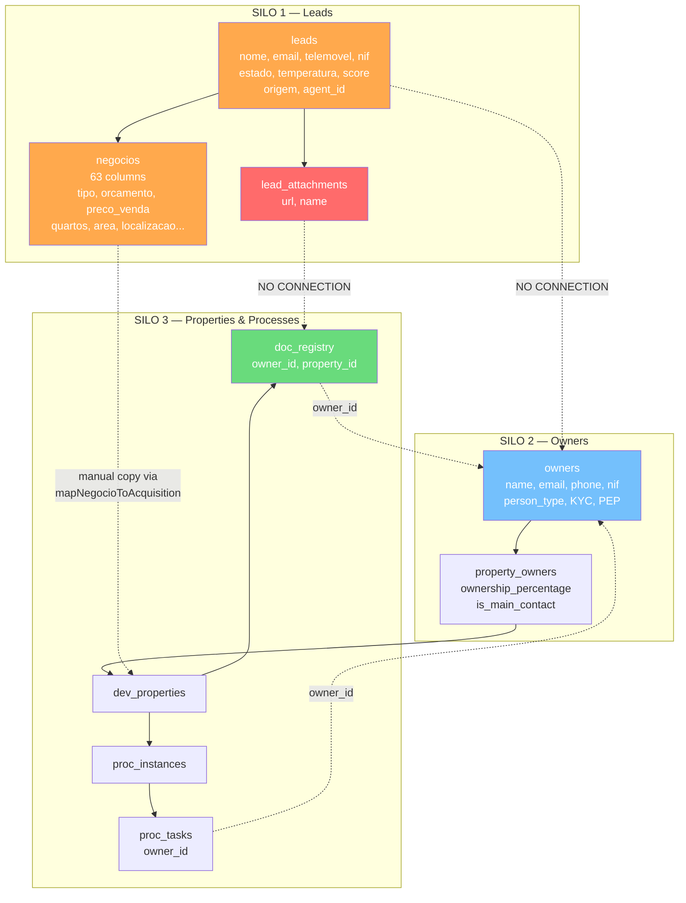
```mermaid
graph TB
    subgraph "SILO 1 — Leads"
        L[leads<br/>nome, email, telemovel, nif<br/>estado, temperatura, score<br/>origem, agent_id]
        LA[lead_attachments<br/>url, name]
        N[negocios<br/>63 columns<br/>tipo, orcamento, preco_venda<br/>quartos, area, localizacao...]
        L --> LA
        L --> N
    end

    subgraph "SILO 2 — Owners"
        O[owners<br/>name, email, phone, nif<br/>person_type, KYC, PEP]
        PO[property_owners<br/>ownership_percentage<br/>is_main_contact]
        O --> PO
    end

    subgraph "SILO 3 — Properties & Processes"
        P[dev_properties]
        DR[doc_registry<br/>owner_id, property_id]
        PI[proc_instances]
        PT[proc_tasks<br/>owner_id]
        P --> DR
        P --> PI
        PI --> PT
        PO --> P
        DR -.->|owner_id| O
        PT -.->|owner_id| O
    end

    LA -.->|NO CONNECTION| DR
    L -.->|NO CONNECTION| O
    N -.->|manual copy via<br/>mapNegocioToAcquisition| P

    style LA fill:#ff6b6b,color:#fff
    style L fill:#ffa94d,color:#fff
    style N fill:#ffa94d,color:#fff
    style O fill:#74c0fc,color:#fff
    style DR fill:#69db7c,color:#fff
```

### 2.2 The Same Person, Fragmented

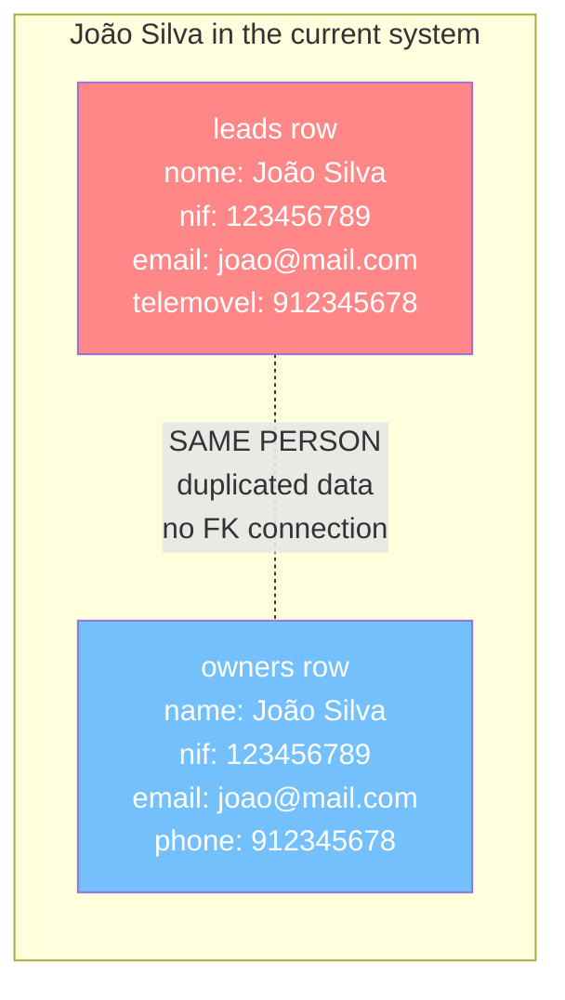
```mermaid
graph LR
    subgraph "João Silva in the current system"
        L1["leads row<br/>nome: João Silva<br/>nif: 123456789<br/>email: joao@mail.com<br/>telemovel: 912345678"]
        O1["owners row<br/>name: João Silva<br/>nif: 123456789<br/>email: joao@mail.com<br/>phone: 912345678"]
    end

    L1 -.-|"SAME PERSON<br/>duplicated data<br/>no FK connection"| O1

    style L1 fill:#ff8787,color:#fff
    style O1 fill:#74c0fc,color:#fff
```

**The same name, NIF, email, and phone stored in two unconnected tables.**

---

## 3. Current Architecture — What Exists Today

### 3.1 Table Inventory

| Table | Language | Rows | Connected To | Purpose |
|-------|----------|------|-------------|---------|
| `leads` | PT | 10 | lead_attachments, negocios | Sales pipeline contacts |
| `owners` | EN | 4 | property_owners, doc_registry, proc_tasks | Property proprietors |
| `negocios` | PT | ~10 | leads (via lead_id) | Buy/sell/rent intentions |
| `lead_attachments` | EN | ~20 | leads (via lead_id) | Lead documents (ISOLATED) |
| `doc_registry` | EN | ~50 | owners, dev_properties | Official documents |
| `property_owners` | EN | ~8 | owners, dev_properties | M:N junction |
| `proc_tasks` | EN | ~100 | owners (via owner_id) | Process tasks per owner |

### 3.2 Field Overlap — leads vs owners


```mermaid
graph TB
    subgraph "leads table (PT)"
        LF1["nome"]
        LF2["email"]
        LF3["telemovel"]
        LF4["nif"]
        LF5["morada, codigo_postal, localidade"]
        LF6["tipo_documento, numero_documento"]
        LF7["nacionalidade"]
        LF8["data_nascimento"]
        LFX1["estado, temperatura, score"]
        LFX2["origem, agent_id"]
        LFX3["consentimento_contacto"]
    end

    subgraph "owners table (EN)"
        OF1["name"]
        OF2["email"]
        OF3["phone"]
        OF4["nif"]
        OF5["address, postal_code, city"]
        OF6["id_doc_type, id_doc_number"]
        OF7["nationality"]
        OF8["birth_date"]
        OFX1["PEP, legal_rep, beneficiaries"]
        OFX2["company fields (coletiva)"]
        OFX3["profession, residence"]
    end

    LF1 ---|"DUPLICATE"| OF1
    LF2 ---|"DUPLICATE"| OF2
    LF3 ---|"DUPLICATE"| OF3
    LF4 ---|"DUPLICATE"| OF4
    LF5 ---|"DUPLICATE"| OF5
    LF6 ---|"DUPLICATE"| OF6
    LF7 ---|"DUPLICATE"| OF7
    LF8 ---|"DUPLICATE"| OF8

    style LF1 fill:#ff8787,color:#fff
    style LF2 fill:#ff8787,color:#fff
    style LF3 fill:#ff8787,color:#fff
    style LF4 fill:#ff8787,color:#fff
    style LF5 fill:#ff8787,color:#fff
    style LF6 fill:#ff8787,color:#fff
    style LF7 fill:#ff8787,color:#fff
    style LF8 fill:#ff8787,color:#fff
    style OF1 fill:#ff8787,color:#fff
    style OF2 fill:#ff8787,color:#fff
    style OF3 fill:#ff8787,color:#fff
    style OF4 fill:#ff8787,color:#fff
    style OF5 fill:#ff8787,color:#fff
    style OF6 fill:#ff8787,color:#fff
    style OF7 fill:#ff8787,color:#fff
    style OF8 fill:#ff8787,color:#fff
    style LFX1 fill:#ffa94d,color:#fff
    style LFX2 fill:#ffa94d,color:#fff
    style LFX3 fill:#ffa94d,color:#fff
    style OFX1 fill:#74c0fc,color:#fff
    style OFX2 fill:#74c0fc,color:#fff
    style OFX3 fill:#74c0fc,color:#fff
```

**Legend:**
- Red = duplicated fields (8 groups of identical data)
- Orange = lead-specific fields (pipeline tracking)
- Blue = owner-specific fields (KYC/compliance)

### 3.3 Negocios — The Over-Engineered Table

The `negocios` table has **63 columns** mixing two fundamentally different concepts:

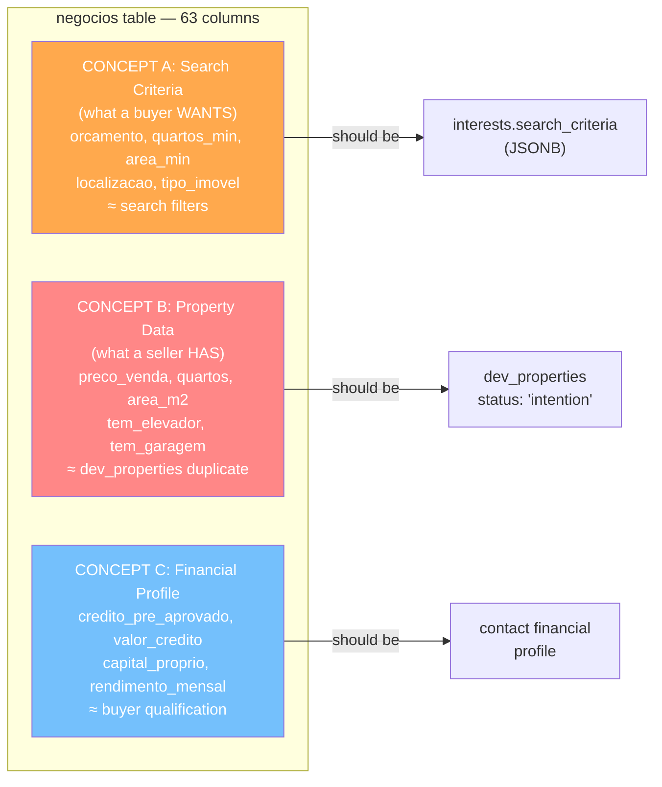
```mermaid
graph LR
    subgraph "negocios table — 63 columns"
        direction TB
        A["CONCEPT A: Search Criteria<br/>(what a buyer WANTS)<br/>orcamento, quartos_min, area_min<br/>localizacao, tipo_imovel<br/>≈ search filters"]
        B["CONCEPT B: Property Data<br/>(what a seller HAS)<br/>preco_venda, quartos, area_m2<br/>tem_elevador, tem_garagem<br/>≈ dev_properties duplicate"]
        C["CONCEPT C: Financial Profile<br/>credito_pre_aprovado, valor_credito<br/>capital_proprio, rendimento_mensal<br/>≈ buyer qualification"]
    end

    A -->|"should be"| SC["interests.search_criteria<br/>(JSONB)"]
    B -->|"should be"| DP["dev_properties<br/>status: 'intention'"]
    C -->|"should be"| FP["contact financial<br/>profile"]

    style A fill:#ffa94d,color:#fff
    style B fill:#ff8787,color:#fff
    style C fill:#74c0fc,color:#fff
```

**The `negocios` table tries to be three things at once.** This is the actual over-engineering in the current system — not the proposed solution.

---

## 4. The 5 Gaps That Hurt

### Gap 1: Documents Don't Flow

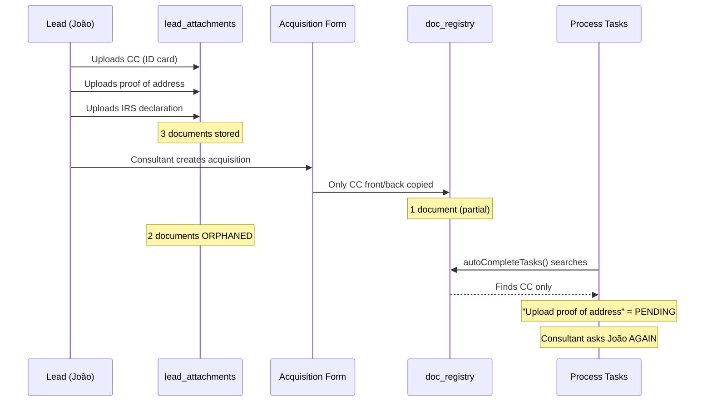
```mermaid
sequenceDiagram
    participant Lead as Lead (João)
    participant LA as lead_attachments
    participant ACQ as Acquisition Form
    participant DR as doc_registry
    participant PROC as Process Tasks

    Lead->>LA: Uploads CC (ID card)
    Lead->>LA: Uploads proof of address
    Lead->>LA: Uploads IRS declaration
    Note over LA: 3 documents stored

    Lead->>ACQ: Consultant creates acquisition
    ACQ->>DR: Only CC front/back copied
    Note over DR: 1 document (partial)
    Note over LA: 2 documents ORPHANED

    PROC->>DR: autoCompleteTasks() searches
    DR-->>PROC: Finds CC only
    Note over PROC: "Upload proof of address" = PENDING
    Note over PROC: Consultant asks João AGAIN
```

**Today:** Lead uploads 3 documents. Only 1 (partially) reaches the process. Consultant asks for the same documents twice.

### Gap 2: Lead Re-entry Creates Duplicates

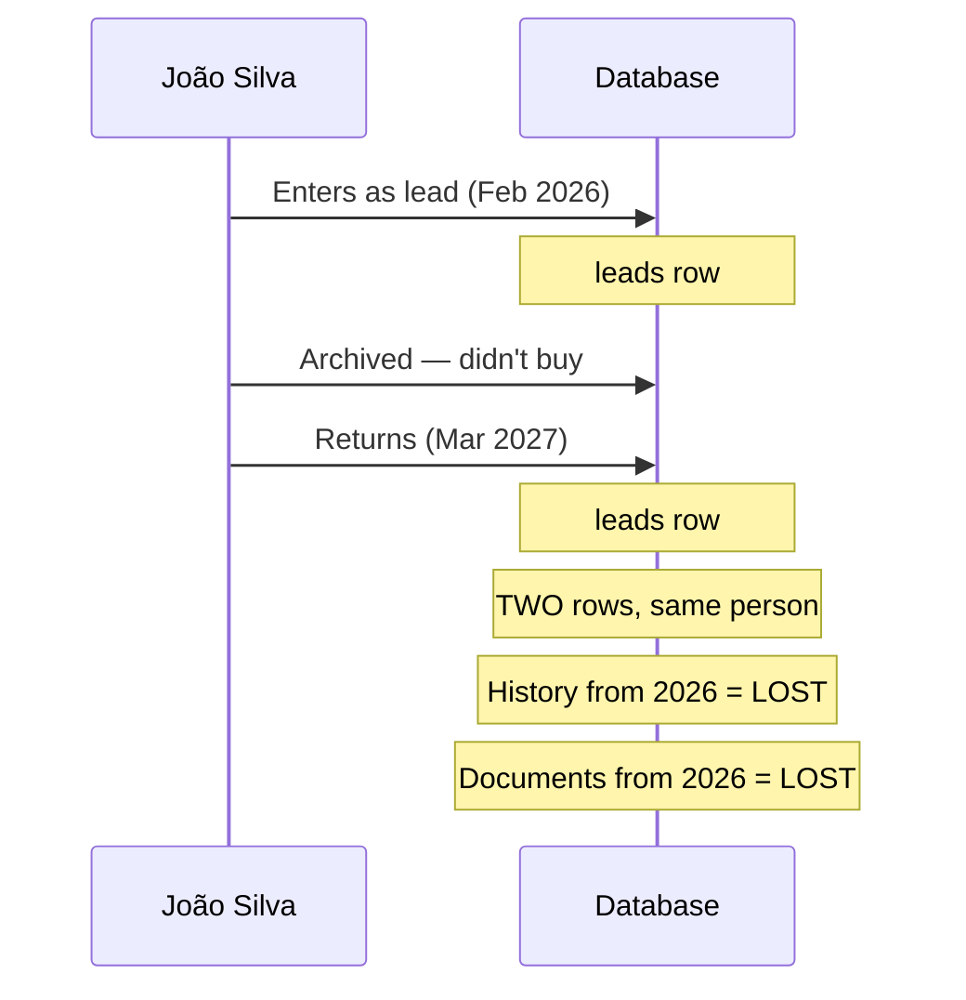
```mermaid
sequenceDiagram
    participant J as João Silva
    participant DB as Database

    J->>DB: Enters as lead (Feb 2026)
    Note over DB: leads row #1 (NIF: 123456789)
    J->>DB: Archived — didn't buy

    J->>DB: Returns (Mar 2027)
    Note over DB: leads row #2 (NIF: 123456789)
    Note over DB: TWO rows, same person
    Note over DB: History from 2026 = LOST
    Note over DB: Documents from 2026 = LOST
```

**No NIF deduplication on leads.** No upsert. History is lost.

### Gap 3: Temperature is Global, Not Contextual

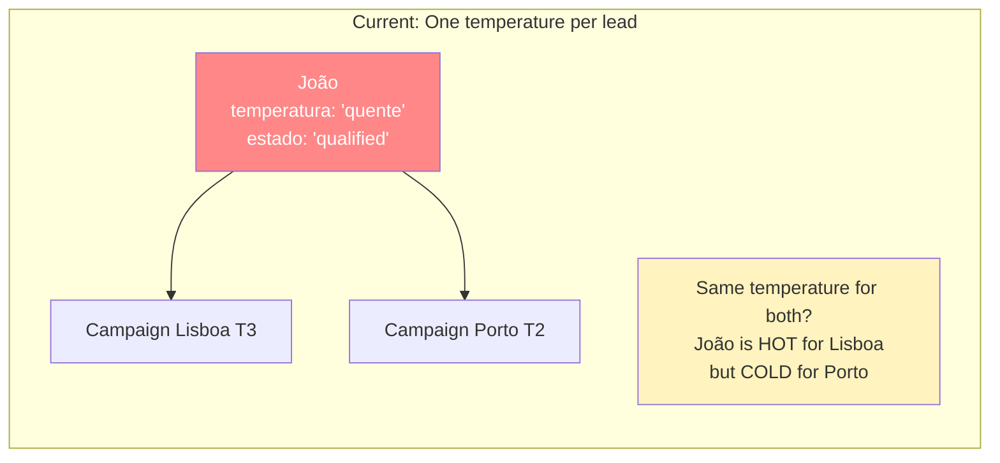
```mermaid
graph LR
    subgraph "Current: One temperature per lead"
        L["João<br/>temperatura: 'quente'<br/>estado: 'qualified'"]
        C1["Campaign Lisboa T3"]
        C2["Campaign Porto T2"]
        L --> C1
        L --> C2
        Note["Same temperature for both?<br/>João is HOT for Lisboa<br/>but COLD for Porto"]
    end

    style L fill:#ff8787,color:#fff
    style Note fill:#fff3bf,color:#333
```

**Impossible** to track different engagement levels per campaign.

### Gap 4: No Lead-to-Owner Traceability

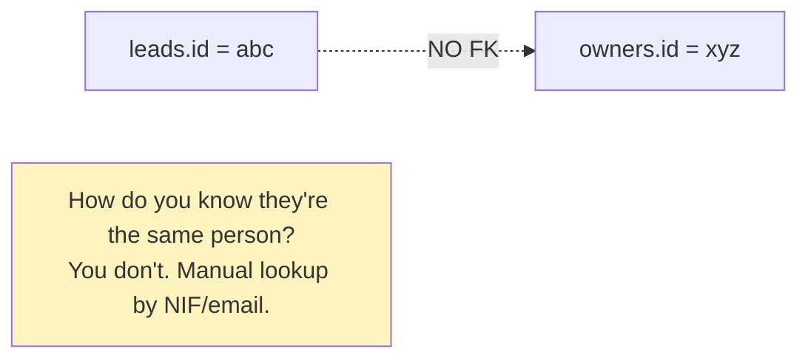
```mermaid
graph LR
    L["leads.id = abc"] -.->|"NO FK"| O["owners.id = xyz"]
    Note["How do you know they're the same person?<br/>You don't. Manual lookup by NIF/email."]

    style Note fill:#fff3bf,color:#333
```

### Gap 5: Negocios Data is Wasted

When a "Venda" negocio describes a T3 in Lisboa with elevator and garage — that IS property data. But it lives in `negocios`, disconnected from `dev_properties`. The consultant must re-enter everything in the acquisition form.

```
negocios.preco_venda = 350000        → manually copied to → dev_properties.listing_price
negocios.quartos = 3                 → manually copied to → dev_property_specifications.bedrooms
negocios.area_m2 = 120               → manually copied to → dev_property_specifications.area_util
negocios.tem_elevador = true         → manually copied to → dev_property_specifications.has_elevator
negocios.localizacao = "Lisboa"      → manually copied to → dev_properties.city
```

---

## 5. Proposed Architecture — Unified Contacts

### 5.1 High-Level Overview

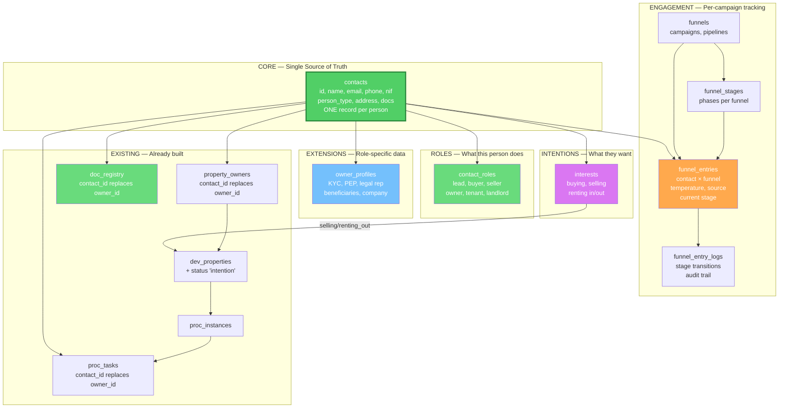
```mermaid
graph TB
    subgraph "CORE — Single Source of Truth"
        C[contacts<br/>id, name, email, phone, nif<br/>person_type, address, docs<br/>ONE record per person]
    end

    subgraph "ROLES — What this person does"
        CR[contact_roles<br/>lead, buyer, seller<br/>owner, tenant, landlord]
    end

    subgraph "EXTENSIONS — Role-specific data"
        OP[owner_profiles<br/>KYC, PEP, legal rep<br/>beneficiaries, company]
    end

    subgraph "ENGAGEMENT — Per-campaign tracking"
        F[funnels<br/>campaigns, pipelines]
        FS[funnel_stages<br/>phases per funnel]
        FE[funnel_entries<br/>contact × funnel<br/>temperature, source<br/>current stage]
        FL[funnel_entry_logs<br/>stage transitions<br/>audit trail]
    end

    subgraph "INTENTIONS — What they want"
        I[interests<br/>buying, selling<br/>renting in/out]
    end

    subgraph "EXISTING — Already built"
        P[dev_properties<br/>+ status 'intention']
        PO[property_owners<br/>contact_id replaces owner_id]
        DR[doc_registry<br/>contact_id replaces owner_id]
        PI[proc_instances]
        PTK[proc_tasks<br/>contact_id replaces owner_id]
    end

    C --> CR
    C --> OP
    C --> FE
    C --> I
    C --> PO
    C --> DR
    C --> PTK

    F --> FS
    F --> FE
    FE --> FL
    FS --> FE

    I -->|"selling/renting_out"| P
    PO --> P
    P --> PI
    PI --> PTK

    style C fill:#51cf66,color:#fff,stroke:#2b8a3e,stroke-width:3px
    style CR fill:#69db7c,color:#fff
    style OP fill:#74c0fc,color:#fff
    style FE fill:#ffa94d,color:#fff
    style I fill:#da77f2,color:#fff
    style DR fill:#69db7c,color:#fff
```

### 5.2 Relationship Map

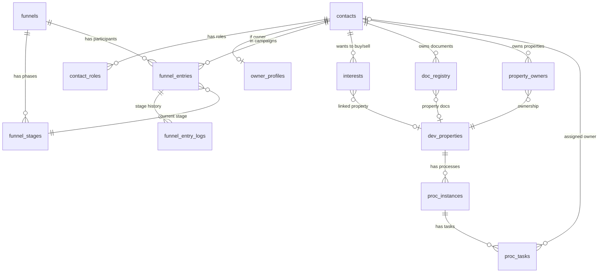
```mermaid
erDiagram
    contacts ||--o{ contact_roles : "has roles"
    contacts ||--o| owner_profiles : "if owner"
    contacts ||--o{ funnel_entries : "in campaigns"
    contacts ||--o{ interests : "wants to buy/sell"
    contacts ||--o{ doc_registry : "owns documents"
    contacts ||--o{ property_owners : "owns properties"

    funnels ||--o{ funnel_stages : "has phases"
    funnels ||--o{ funnel_entries : "has participants"
    funnel_entries ||--o{ funnel_entry_logs : "stage history"
    funnel_entries }o--|| funnel_stages : "current stage"

    interests }o--o| dev_properties : "linked property"
    property_owners }o--|| dev_properties : "ownership"
    dev_properties ||--o{ proc_instances : "has processes"
    proc_instances ||--o{ proc_tasks : "has tasks"
    proc_tasks }o--o| contacts : "assigned owner"
    doc_registry }o--o| dev_properties : "property docs"
```

---

## 6. Schema Design — Table by Table

### 6.1 `contacts` — The Core Identity Table

```sql
CREATE TABLE contacts (
    id              UUID PRIMARY KEY DEFAULT gen_random_uuid(),
    person_type     TEXT NOT NULL DEFAULT 'individual',
        -- 'individual' | 'company'

    -- Identity
    name            TEXT NOT NULL,
    email           TEXT,
    phone           TEXT,
    phone_secondary TEXT,
    nif             TEXT UNIQUE,

    -- Document
    id_doc_type     TEXT,        -- 'cc' | 'bi' | 'passport' | 'residence_permit'
    id_doc_number   TEXT,
    id_doc_expiry   DATE,
    id_doc_issued_by TEXT,

    -- Personal (individual)
    birth_date      DATE,
    gender          TEXT,
    nationality     TEXT,
    natural_from    TEXT,        -- naturalidade

    -- Address
    address         TEXT,
    postal_code     TEXT,
    city            TEXT,
    district        TEXT,
    parish          TEXT,       -- freguesia
    country         TEXT DEFAULT 'PT',

    -- Company (person_type = 'company')
    company_name    TEXT,        -- nome comercial se diferente
    company_nif     TEXT,        -- NIPC
    legal_nature    TEXT,
    company_object  TEXT,
    cae_code        TEXT,

    -- Consent
    gdpr_consent        BOOLEAN DEFAULT false,
    marketing_consent   BOOLEAN DEFAULT false,
    preferred_language  TEXT DEFAULT 'PT',

    -- Meta
    notes           TEXT,
    created_at      TIMESTAMPTZ DEFAULT now(),
    updated_at      TIMESTAMPTZ DEFAULT now()
);

CREATE UNIQUE INDEX idx_contacts_nif ON contacts(nif) WHERE nif IS NOT NULL;
CREATE INDEX idx_contacts_email ON contacts(email);
CREATE INDEX idx_contacts_phone ON contacts(phone);
CREATE INDEX idx_contacts_name ON contacts USING gin(name gin_trgm_ops);
```

**What moved here:** All shared fields from `leads` (nome, email, telemovel, nif, morada...) and `owners` (name, email, phone, nif, address...). Standardised to English.

### 6.2 `contact_roles` — What This Person Does

```sql
CREATE TABLE contact_roles (
    id          UUID PRIMARY KEY DEFAULT gen_random_uuid(),
    contact_id  UUID NOT NULL REFERENCES contacts(id) ON DELETE CASCADE,
    role        TEXT NOT NULL,
        -- 'lead' | 'buyer' | 'seller' | 'owner' | 'tenant' | 'landlord'
    is_active   BOOLEAN DEFAULT true,
    assigned_at TIMESTAMPTZ DEFAULT now(),

    UNIQUE(contact_id, role)
);
```

**One person, many roles.** João can be a lead, buyer, AND owner simultaneously.

### 6.3 `owner_profiles` — KYC Extension (Owners Only)

```sql
CREATE TABLE owner_profiles (
    contact_id  UUID PRIMARY KEY REFERENCES contacts(id) ON DELETE CASCADE,

    -- KYC / Compliance
    marital_status      TEXT,
    profession          TEXT,
    last_profession     TEXT,
    is_portugal_resident BOOLEAN DEFAULT true,
    residence_country   TEXT,
    funds_origin        TEXT,

    -- PEP (Politically Exposed Person)
    is_pep              BOOLEAN DEFAULT false,
    pep_position        TEXT,

    -- Company-specific (person_type = 'company')
    legal_representative_name TEXT,
    legal_representative_nif  TEXT,
    legal_rep_id_doc    TEXT,
    company_cert_url    TEXT,
    company_branches    TEXT,
    rcbe_code           TEXT,
    country_of_incorporation TEXT,
    beneficiaries_json  JSONB,      -- array of beneficial owners

    -- Meta
    created_at  TIMESTAMPTZ DEFAULT now(),
    updated_at  TIMESTAMPTZ DEFAULT now()
);
```

**Only created when a contact becomes an owner.** Keeps `contacts` clean.

### 6.4 `funnels` — Campaign/Pipeline Definition

```sql
CREATE TABLE funnels (
    id          UUID PRIMARY KEY DEFAULT gen_random_uuid(),
    name        TEXT NOT NULL,              -- "Campanha T3 Lisboa Centro"
    description TEXT,
    type        TEXT NOT NULL DEFAULT 'generic',
        -- 'acquisition' | 'sale' | 'rental' | 'recruitment' | 'generic'
    property_id UUID REFERENCES dev_properties(id),
        -- NULL for generic campaigns, set for property-specific
    is_active   BOOLEAN DEFAULT true,
    created_by  UUID REFERENCES dev_users(id),
    created_at  TIMESTAMPTZ DEFAULT now(),
    updated_at  TIMESTAMPTZ DEFAULT now()
);
```

### 6.5 `funnel_stages` — Phases Within a Funnel

```sql
CREATE TABLE funnel_stages (
    id            UUID PRIMARY KEY DEFAULT gen_random_uuid(),
    funnel_id     UUID NOT NULL REFERENCES funnels(id) ON DELETE CASCADE,
    name          TEXT NOT NULL,           -- "New", "Contacted", "Qualified", "Proposal", "Won", "Lost"
    order_index   INT NOT NULL DEFAULT 0,
    color         TEXT,                    -- hex for UI
    is_terminal   BOOLEAN DEFAULT false,   -- final stage (won or lost)
    terminal_type TEXT,                    -- 'won' | 'lost' | NULL
    created_at    TIMESTAMPTZ DEFAULT now(),

    UNIQUE(funnel_id, order_index)
);
```

### 6.6 `funnel_entries` — Contact Inside a Funnel

```sql
CREATE TABLE funnel_entries (
    id                UUID PRIMARY KEY DEFAULT gen_random_uuid(),
    contact_id        UUID NOT NULL REFERENCES contacts(id) ON DELETE CASCADE,
    funnel_id         UUID NOT NULL REFERENCES funnels(id) ON DELETE CASCADE,
    current_stage_id  UUID NOT NULL REFERENCES funnel_stages(id),

    -- Engagement
    temperature       TEXT DEFAULT 'cold',
        -- 'cold' | 'warm' | 'hot'

    -- Attribution
    source            TEXT,
        -- 'organic' | 'paid' | 'whatsapp' | 'newsletter'
        -- | 'referral' | 'walk_in' | 'phone' | 'portal_idealista'
        -- | 'portal_imovirtual' | 'portal_casa_sapo' | 'social_media'
    source_detail     TEXT,
        -- "Facebook Ad #1234", "Referido por Manuel Silva", etc.

    -- Assignment
    assigned_to       UUID REFERENCES dev_users(id),

    -- Timestamps
    entered_at        TIMESTAMPTZ DEFAULT now(),
    last_activity_at  TIMESTAMPTZ DEFAULT now(),
    converted_at      TIMESTAMPTZ,

    -- State
    is_active         BOOLEAN DEFAULT true,

    UNIQUE(contact_id, funnel_id)
);

CREATE INDEX idx_funnel_entries_funnel ON funnel_entries(funnel_id);
CREATE INDEX idx_funnel_entries_contact ON funnel_entries(contact_id);
CREATE INDEX idx_funnel_entries_stage ON funnel_entries(current_stage_id);
```

### 6.7 `funnel_entry_logs` — Audit Trail

```sql
CREATE TABLE funnel_entry_logs (
    id                UUID PRIMARY KEY DEFAULT gen_random_uuid(),
    entry_id          UUID NOT NULL REFERENCES funnel_entries(id) ON DELETE CASCADE,
    from_stage_id     UUID REFERENCES funnel_stages(id),
    to_stage_id       UUID NOT NULL REFERENCES funnel_stages(id),
    from_temperature  TEXT,
    to_temperature    TEXT,
    changed_by        UUID REFERENCES dev_users(id),
    notes             TEXT,
    created_at        TIMESTAMPTZ DEFAULT now()
);
```

### 6.8 `interests` — What They Want (Replaces negocios)

```sql
CREATE TABLE interests (
    id          UUID PRIMARY KEY DEFAULT gen_random_uuid(),
    contact_id  UUID NOT NULL REFERENCES contacts(id) ON DELETE CASCADE,

    -- Direction
    direction   TEXT NOT NULL,
        -- 'buying' | 'selling' | 'renting_in' | 'renting_out'

    -- Status
    status      TEXT NOT NULL DEFAULT 'open',
        -- 'open' | 'active' | 'proposal' | 'closed_won' | 'closed_lost'
    lost_reason TEXT,

    -- FOR SELLERS / LANDLORDS: link to actual property
    property_id UUID REFERENCES dev_properties(id),
        -- When selling: points to dev_properties (status: 'intention' → 'active')
        -- When buying: NULL (no property yet)

    -- FOR BUYERS / TENANTS: search criteria
    search_criteria JSONB,
        -- {
        --   "property_type": "apartment",
        --   "zones": ["Lisboa", "Cascais"],
        --   "budget_min": 200000,
        --   "budget_max": 300000,
        --   "min_rooms": 2,
        --   "min_area": 80,
        --   "amenities": ["elevator", "parking", "balcony"]
        -- }

    -- Financial profile (buyers)
    budget_min          NUMERIC,
    budget_max          NUMERIC,
    credit_pre_approved BOOLEAN,
    credit_amount       NUMERIC,
    own_capital         NUMERIC,
    financing_needed    BOOLEAN,
    purchase_timeline   TEXT,       -- '1_month' | '3_months' | '6_months' | '1_year'

    -- Rental specific
    max_monthly_rent    NUMERIC,    -- tenant
    desired_rent        NUMERIC,    -- landlord
    min_contract_months INT,
    deposit_months      INT,
    accepts_pets        BOOLEAN,
    furnished           BOOLEAN,

    -- Notes
    notes       TEXT,

    -- Funnel link (optional — which campaign generated this interest)
    funnel_entry_id UUID REFERENCES funnel_entries(id),

    -- Meta
    created_at  TIMESTAMPTZ DEFAULT now(),
    updated_at  TIMESTAMPTZ DEFAULT now()
);

CREATE INDEX idx_interests_contact ON interests(contact_id);
CREATE INDEX idx_interests_direction ON interests(direction);
CREATE INDEX idx_interests_status ON interests(status);
CREATE INDEX idx_interests_property ON interests(property_id) WHERE property_id IS NOT NULL;
```

### 6.9 FK Changes on Existing Tables

```sql
-- doc_registry: owner_id → contact_id
ALTER TABLE doc_registry RENAME COLUMN owner_id TO contact_id;
ALTER TABLE doc_registry
    DROP CONSTRAINT IF EXISTS doc_registry_owner_id_fkey,
    ADD CONSTRAINT doc_registry_contact_id_fkey
        FOREIGN KEY (contact_id) REFERENCES contacts(id);

-- property_owners: owner_id → contact_id
ALTER TABLE property_owners RENAME COLUMN owner_id TO contact_id;
ALTER TABLE property_owners
    DROP CONSTRAINT IF EXISTS property_owners_owner_id_fkey,
    ADD CONSTRAINT property_owners_contact_id_fkey
        FOREIGN KEY (contact_id) REFERENCES contacts(id);

-- proc_tasks: owner_id → contact_id
ALTER TABLE proc_tasks RENAME COLUMN owner_id TO contact_id;
ALTER TABLE proc_tasks
    DROP CONSTRAINT IF EXISTS proc_tasks_owner_id_fkey,
    ADD CONSTRAINT proc_tasks_contact_id_fkey
        FOREIGN KEY (contact_id) REFERENCES contacts(id);

-- dev_properties: add 'intention' to status
-- (no schema change needed — status is TEXT, just use the new value)
```

---

## 7. Data Flow — Before vs After

### 7.1 Document Flow

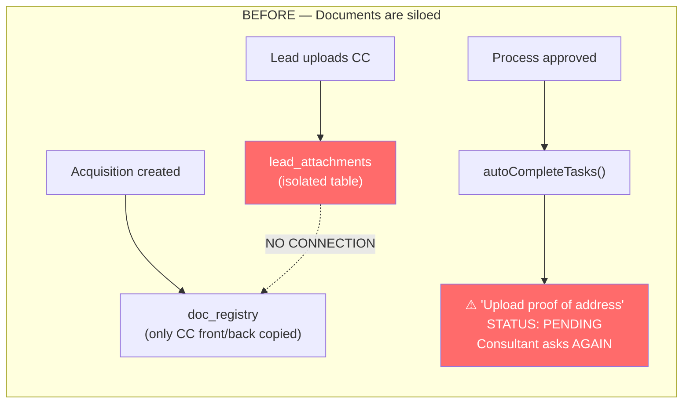
```mermaid
graph TB
    subgraph "BEFORE — Documents are siloed"
        direction TB
        B_LEAD["Lead uploads CC"]
        B_LA["lead_attachments<br/>(isolated table)"]
        B_ACQ["Acquisition created"]
        B_DR["doc_registry<br/>(only CC front/back copied)"]
        B_PROC["Process approved"]
        B_AUTO["autoCompleteTasks()"]
        B_MISS["⚠️ 'Upload proof of address'<br/>STATUS: PENDING<br/>Consultant asks AGAIN"]

        B_LEAD --> B_LA
        B_ACQ --> B_DR
        B_PROC --> B_AUTO
        B_AUTO --> B_MISS
        B_LA -.->|"NO CONNECTION"| B_DR
    end

    style B_LA fill:#ff6b6b,color:#fff
    style B_MISS fill:#ff6b6b,color:#fff
```

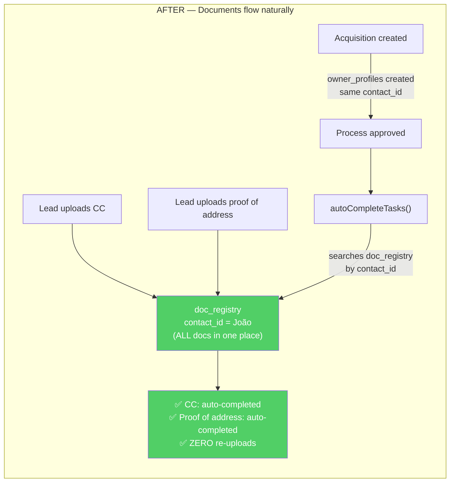
```mermaid
graph TB
    subgraph "AFTER — Documents flow naturally"
        direction TB
        A_LEAD["Lead uploads CC"]
        A_DR["doc_registry<br/>contact_id = João<br/>(ALL docs in one place)"]
        A_LEAD2["Lead uploads proof of address"]
        A_ACQ["Acquisition created"]
        A_PROC["Process approved"]
        A_AUTO["autoCompleteTasks()"]
        A_OK["✅ CC: auto-completed<br/>✅ Proof of address: auto-completed<br/>✅ ZERO re-uploads"]

        A_LEAD --> A_DR
        A_LEAD2 --> A_DR
        A_ACQ -->|"owner_profiles created<br/>same contact_id"| A_PROC
        A_PROC --> A_AUTO
        A_AUTO -->|"searches doc_registry<br/>by contact_id"| A_DR
        A_DR --> A_OK
    end

    style A_DR fill:#51cf66,color:#fff
    style A_OK fill:#51cf66,color:#fff
```

### 7.2 Lead Re-entry Flow

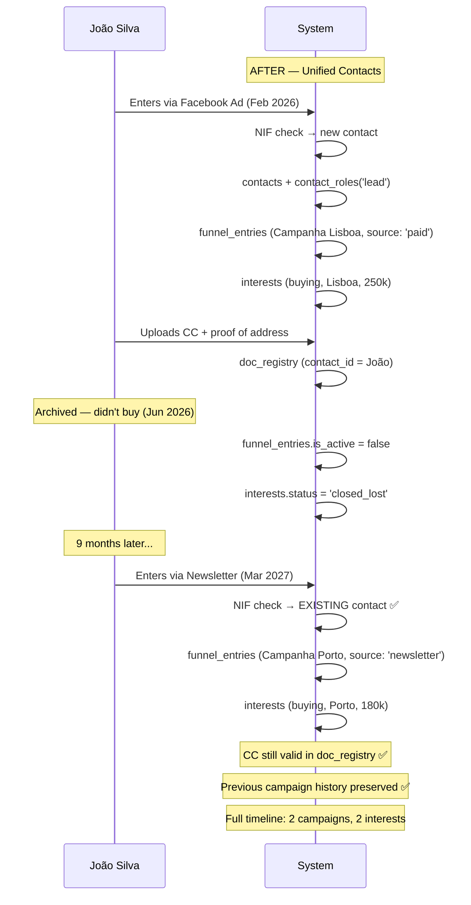
```mermaid
sequenceDiagram
    participant J as João Silva
    participant SYS as System

    Note over SYS: AFTER — Unified Contacts

    J->>SYS: Enters via Facebook Ad (Feb 2026)
    SYS->>SYS: NIF check → new contact
    SYS->>SYS: contacts + contact_roles('lead')
    SYS->>SYS: funnel_entries (Campanha Lisboa, source: 'paid')
    SYS->>SYS: interests (buying, Lisboa, 250k)

    J->>SYS: Uploads CC + proof of address
    SYS->>SYS: doc_registry (contact_id = João)

    Note over J: Archived — didn't buy (Jun 2026)
    SYS->>SYS: funnel_entries.is_active = false
    SYS->>SYS: interests.status = 'closed_lost'

    Note over J: 9 months later...

    J->>SYS: Enters via Newsletter (Mar 2027)
    SYS->>SYS: NIF check → EXISTING contact ✅
    SYS->>SYS: funnel_entries (Campanha Porto, source: 'newsletter')
    SYS->>SYS: interests (buying, Porto, 180k)

    Note over SYS: CC still valid in doc_registry ✅
    Note over SYS: Previous campaign history preserved ✅
    Note over SYS: Full timeline: 2 campaigns, 2 interests
```

---

## 8. Funnel & Campaign System

### 8.1 How Funnels Work

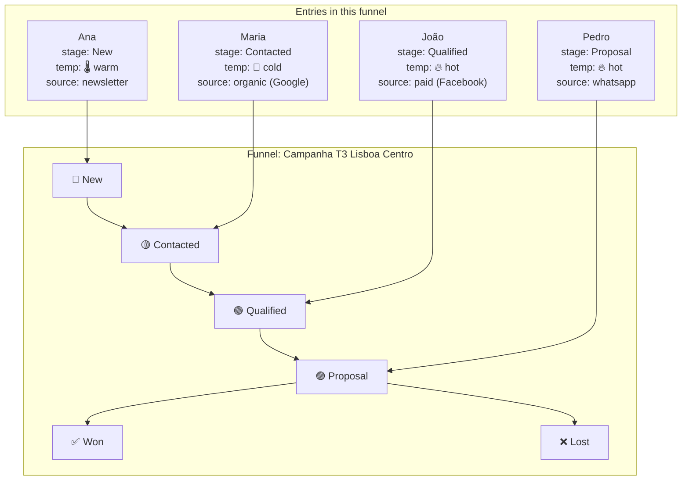
```mermaid
graph TB
    subgraph "Funnel: Campanha T3 Lisboa Centro"
        direction LR
        S1["🔵 New"]
        S2["🟡 Contacted"]
        S3["🟢 Qualified"]
        S4["🟣 Proposal"]
        S5["✅ Won"]
        S6["❌ Lost"]

        S1 --> S2 --> S3 --> S4 --> S5
        S4 --> S6
    end

    subgraph "Entries in this funnel"
        E1["João<br/>stage: Qualified<br/>temp: 🔥 hot<br/>source: paid (Facebook)"]
        E2["Maria<br/>stage: Contacted<br/>temp: 🧊 cold<br/>source: organic (Google)"]
        E3["Pedro<br/>stage: Proposal<br/>temp: 🔥 hot<br/>source: whatsapp"]
        E4["Ana<br/>stage: New<br/>temp: 🌡️ warm<br/>source: newsletter"]
    end

    E1 --> S3
    E2 --> S2
    E3 --> S4
    E4 --> S1
```

### 8.2 Same Contact, Different Funnels

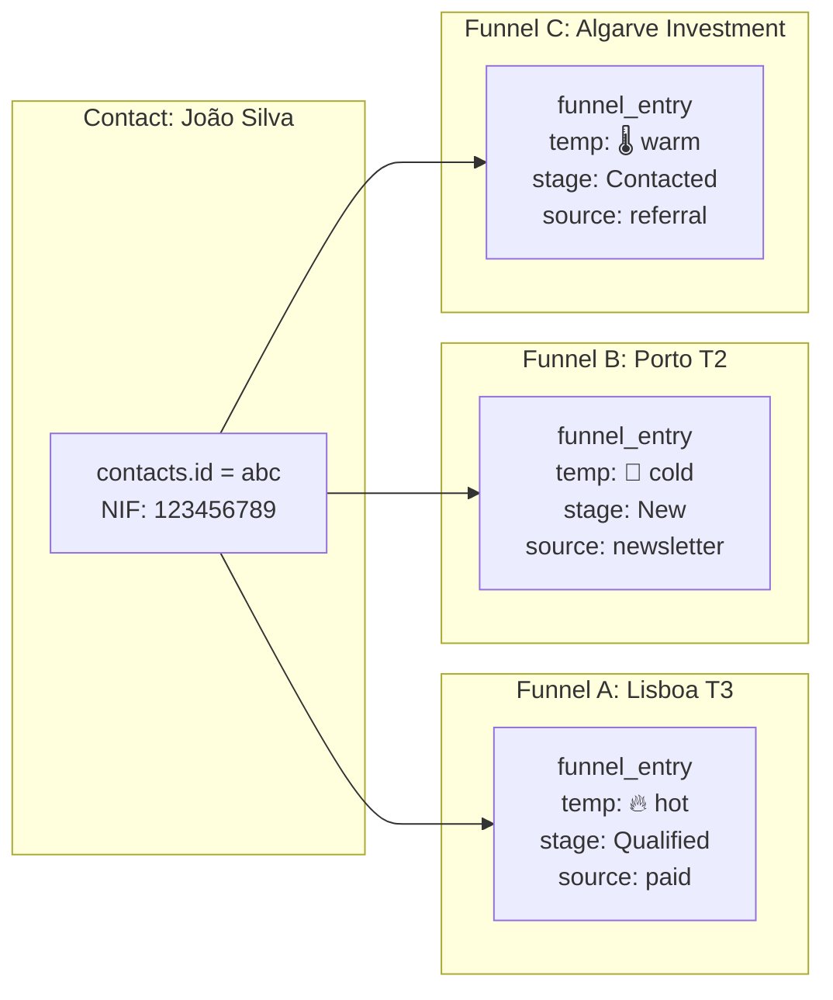
```mermaid
graph LR
    subgraph "Contact: João Silva"
        J["contacts.id = abc<br/>NIF: 123456789"]
    end

    subgraph "Funnel A: Lisboa T3"
        FA_E["funnel_entry<br/>temp: 🔥 hot<br/>stage: Qualified<br/>source: paid"]
    end

    subgraph "Funnel B: Porto T2"
        FB_E["funnel_entry<br/>temp: 🧊 cold<br/>stage: New<br/>source: newsletter"]
    end

    subgraph "Funnel C: Algarve Investment"
        FC_E["funnel_entry<br/>temp: 🌡️ warm<br/>stage: Contacted<br/>source: referral"]
    end

    J --> FA_E
    J --> FB_E
    J --> FC_E
```

**Three simultaneous campaigns, three independent states.** Impossible in the current system where temperature is a single field on the lead.

### 8.3 Campaign Analytics

```sql
-- Performance by source for a campaign
SELECT
    fe.source,
    fs.name AS current_stage,
    fe.temperature,
    COUNT(*) AS total
FROM funnel_entries fe
JOIN funnel_stages fs ON fs.id = fe.current_stage_id
WHERE fe.funnel_id = 'campanha-lisboa-uuid'
GROUP BY fe.source, fs.name, fe.temperature
ORDER BY fe.source, fs.order_index;

-- Result:
-- paid      | New        | cold | 45
-- paid      | Contacted  | warm | 23
-- paid      | Qualified  | hot  | 12
-- paid      | Won        | hot  |  3
-- organic   | New        | cold | 20
-- organic   | Contacted  | warm |  8
-- whatsapp  | Qualified  | hot  |  5
-- newsletter| New        | cold | 30
-- newsletter| Contacted  | warm | 10

-- Conversion rate by source
SELECT
    fe.source,
    COUNT(*) AS total_entries,
    COUNT(*) FILTER (WHERE fs.terminal_type = 'won') AS won,
    ROUND(
        COUNT(*) FILTER (WHERE fs.terminal_type = 'won')::NUMERIC /
        NULLIF(COUNT(*), 0) * 100, 1
    ) AS conversion_rate
FROM funnel_entries fe
JOIN funnel_stages fs ON fs.id = fe.current_stage_id
WHERE fe.funnel_id = 'campanha-lisboa-uuid'
GROUP BY fe.source;
```

---

## 9. Interest System — Replacing Negocios

### 9.1 Selling Interest → Property with 'intention' Status

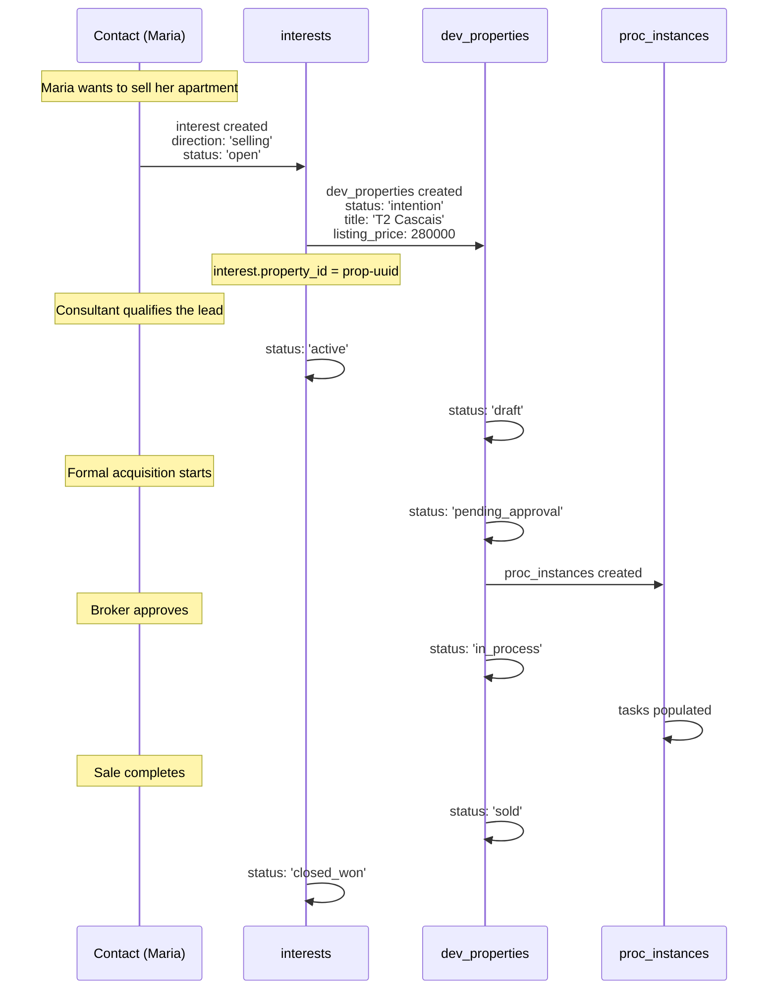
```mermaid
sequenceDiagram
    participant C as Contact (Maria)
    participant I as interests
    participant P as dev_properties
    participant PROC as proc_instances

    Note over C: Maria wants to sell her apartment

    C->>I: interest created<br/>direction: 'selling'<br/>status: 'open'
    I->>P: dev_properties created<br/>status: 'intention'<br/>title: 'T2 Cascais'<br/>listing_price: 280000
    Note over I: interest.property_id = prop-uuid

    Note over C: Consultant qualifies the lead
    I->>I: status: 'active'
    P->>P: status: 'draft'

    Note over C: Formal acquisition starts
    P->>P: status: 'pending_approval'
    P->>PROC: proc_instances created

    Note over C: Broker approves
    P->>P: status: 'in_process'
    PROC->>PROC: tasks populated

    Note over C: Sale completes
    P->>P: status: 'sold'
    I->>I: status: 'closed_won'
```

### 9.2 Buying Interest → Search Criteria + Matching

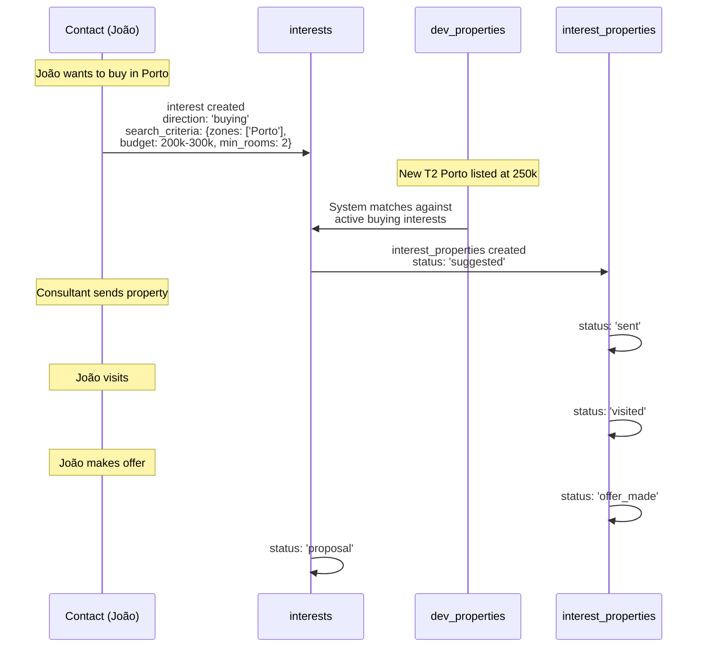
```mermaid
sequenceDiagram
    participant C as Contact (João)
    participant I as interests
    participant P as dev_properties
    participant IP as interest_properties

    Note over C: João wants to buy in Porto

    C->>I: interest created<br/>direction: 'buying'<br/>search_criteria: {zones: ['Porto'],<br/>budget: 200k-300k, min_rooms: 2}

    Note over P: New T2 Porto listed at 250k

    P->>I: System matches against<br/>active buying interests
    I->>IP: interest_properties created<br/>status: 'suggested'

    Note over C: Consultant sends property
    IP->>IP: status: 'sent'

    Note over C: João visits
    IP->>IP: status: 'visited'

    Note over C: João makes offer
    IP->>IP: status: 'offer_made'
    I->>I: status: 'proposal'
```

### 9.3 interest_properties — Tracking Sent Properties

```sql
-- Replaces negocio_properties with cleaner naming
CREATE TABLE interest_properties (
    id              UUID PRIMARY KEY DEFAULT gen_random_uuid(),
    interest_id     UUID NOT NULL REFERENCES interests(id) ON DELETE CASCADE,
    property_id     UUID REFERENCES dev_properties(id),

    -- Status tracking
    status          TEXT NOT NULL DEFAULT 'suggested',
        -- 'suggested' | 'sent' | 'visited' | 'interested'
        -- | 'offer_made' | 'discarded'

    -- External properties (from portals)
    external_url    TEXT,
    external_title  TEXT,
    external_price  NUMERIC,
    external_source TEXT,       -- 'idealista' | 'imovirtual' | 'casa_sapo'

    -- Timestamps
    sent_at         TIMESTAMPTZ,
    visited_at      TIMESTAMPTZ,
    notes           TEXT,
    created_at      TIMESTAMPTZ DEFAULT now()
);
```

---

## 10. Document Flow — The Key Win

### 10.1 Unified Document Ownership

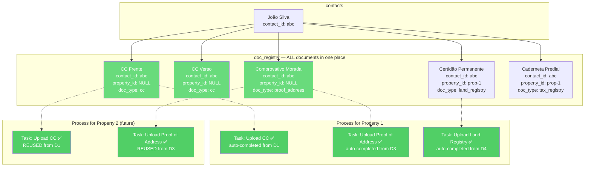
```mermaid
graph TB
    subgraph "contacts"
        C1["João Silva<br/>contact_id: abc"]
    end

    subgraph "doc_registry — ALL documents in one place"
        D1["CC Frente<br/>contact_id: abc<br/>property_id: NULL<br/>doc_type: cc"]
        D2["CC Verso<br/>contact_id: abc<br/>property_id: NULL<br/>doc_type: cc"]
        D3["Comprovativo Morada<br/>contact_id: abc<br/>property_id: NULL<br/>doc_type: proof_address"]
        D4["Certidão Permanente<br/>contact_id: abc<br/>property_id: prop-1<br/>doc_type: land_registry"]
        D5["Caderneta Predial<br/>contact_id: abc<br/>property_id: prop-1<br/>doc_type: tax_registry"]
    end

    C1 --> D1
    C1 --> D2
    C1 --> D3
    C1 --> D4
    C1 --> D5

    subgraph "Process for Property 1"
        T1["Task: Upload CC ✅<br/>auto-completed from D1"]
        T2["Task: Upload Proof of Address ✅<br/>auto-completed from D3"]
        T3["Task: Upload Land Registry ✅<br/>auto-completed from D4"]
    end

    D1 -.-> T1
    D3 -.-> T2
    D4 -.-> T3

    subgraph "Process for Property 2 (future)"
        T4["Task: Upload CC ✅<br/>REUSED from D1"]
        T5["Task: Upload Proof of Address ✅<br/>REUSED from D3"]
    end

    D1 -.-> T4
    D3 -.-> T5

    style D1 fill:#69db7c,color:#fff
    style D2 fill:#69db7c,color:#fff
    style D3 fill:#69db7c,color:#fff
    style T1 fill:#51cf66,color:#fff
    style T2 fill:#51cf66,color:#fff
    style T3 fill:#51cf66,color:#fff
    style T4 fill:#51cf66,color:#fff
    style T5 fill:#51cf66,color:#fff
```

**Personal documents (CC, proof of address) are uploaded ONCE and reused across ALL processes.** Property-specific documents (land registry) are linked to both contact and property.

### 10.2 autoCompleteTasks() — Updated Logic

```
CURRENT:
  Search doc_registry WHERE owner_id IN (property owners)

PROPOSED:
  Search doc_registry WHERE contact_id IN (property owners' contact_ids)
  → Finds ALL documents ever uploaded by this person
  → Including docs uploaded when they were "just a lead"
  → Including docs from previous properties/processes
```

---

## 11. Contact Lifecycle — Complete Journey

### 11.1 Full Journey of João Silva

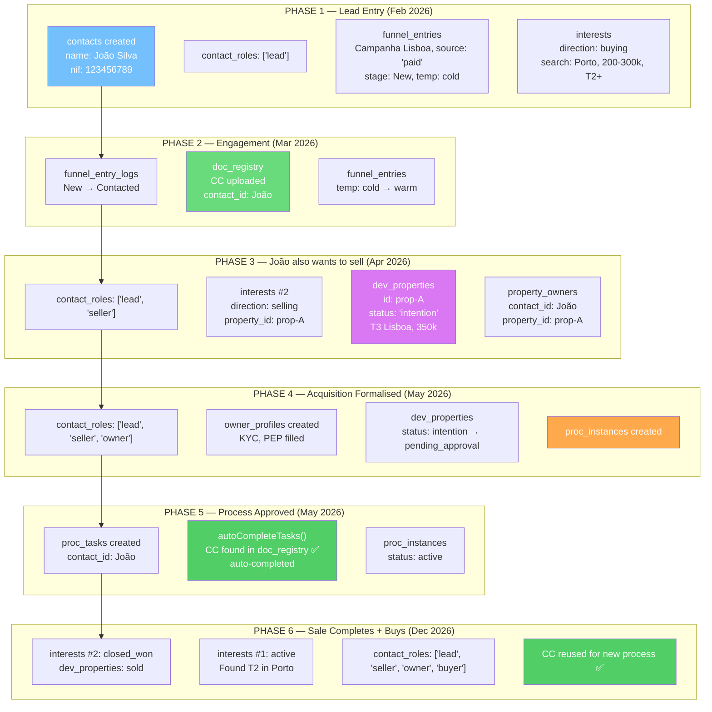
```mermaid
graph TB
    subgraph "PHASE 1 — Lead Entry (Feb 2026)"
        P1A["contacts created<br/>name: João Silva<br/>nif: 123456789"]
        P1B["contact_roles: ['lead']"]
        P1C["funnel_entries<br/>Campanha Lisboa, source: 'paid'<br/>stage: New, temp: cold"]
        P1D["interests<br/>direction: buying<br/>search: Porto, 200-300k, T2+"]
    end

    subgraph "PHASE 2 — Engagement (Mar 2026)"
        P2A["funnel_entry_logs<br/>New → Contacted"]
        P2B["doc_registry<br/>CC uploaded<br/>contact_id: João"]
        P2C["funnel_entries<br/>temp: cold → warm"]
    end

    subgraph "PHASE 3 — João also wants to sell (Apr 2026)"
        P3A["contact_roles: ['lead', 'seller']"]
        P3B["interests #2<br/>direction: selling<br/>property_id: prop-A"]
        P3C["dev_properties<br/>id: prop-A<br/>status: 'intention'<br/>T3 Lisboa, 350k"]
        P3D["property_owners<br/>contact_id: João<br/>property_id: prop-A"]
    end

    subgraph "PHASE 4 — Acquisition Formalised (May 2026)"
        P4A["contact_roles: ['lead', 'seller', 'owner']"]
        P4B["owner_profiles created<br/>KYC, PEP filled"]
        P4C["dev_properties<br/>status: intention → pending_approval"]
        P4D["proc_instances created"]
    end

    subgraph "PHASE 5 — Process Approved (May 2026)"
        P5A["proc_tasks created<br/>contact_id: João"]
        P5B["autoCompleteTasks()<br/>CC found in doc_registry ✅<br/>auto-completed"]
        P5C["proc_instances<br/>status: active"]
    end

    subgraph "PHASE 6 — Sale Completes + Buys (Dec 2026)"
        P6A["interests #2: closed_won<br/>dev_properties: sold"]
        P6B["interests #1: active<br/>Found T2 in Porto"]
        P6C["contact_roles: ['lead', 'seller', 'owner', 'buyer']"]
        P6D["CC reused for new process ✅"]
    end

    P1A --> P2A
    P2A --> P3A
    P3A --> P4A
    P4A --> P5A
    P5A --> P6A

    style P1A fill:#74c0fc,color:#fff
    style P2B fill:#69db7c,color:#fff
    style P3C fill:#da77f2,color:#fff
    style P4D fill:#ffa94d,color:#fff
    style P5B fill:#51cf66,color:#fff
    style P6D fill:#51cf66,color:#fff
```

### 11.2 Contact 360° View — What the UI Shows

```
┌──────────────────────────────────────────────────────────────────┐
│  JOÃO SILVA                                         NIF: 123456789│
│  joao@mail.com  |  912 345 678  |  Lisboa, PT                    │
│                                                                   │
│  Roles: 🏷️ Lead  🏷️ Seller  🏷️ Owner  🏷️ Buyer                │
├──────────────────────────────────────────────────────────────────┤
│                                                                   │
│  📊 CAMPAIGNS (2)                                                │
│  ┌─────────────────────────────────────────────────────────┐     │
│  │ Campanha Lisboa T3    │ 🔥 Hot  │ Qualified │ paid      │     │
│  │ Campanha Porto T2     │ 🧊 Cold │ New       │ newsletter│     │
│  └─────────────────────────────────────────────────────────┘     │
│                                                                   │
│  🎯 INTERESTS (3)                                                │
│  ┌─────────────────────────────────────────────────────────┐     │
│  │ 🟢 Selling T3 Lisboa  │ €350k │ Closed (Sold)          │     │
│  │ 🔵 Buying Porto       │ €200-300k │ Active              │     │
│  │ 🟡 Renting out T1     │ €800/month │ Open               │     │
│  └─────────────────────────────────────────────────────────┘     │
│                                                                   │
│  🏠 PROPERTIES (2)                                               │
│  ┌─────────────────────────────────────────────────────────┐     │
│  │ T3 Lisboa (REF-2026-001)  │ Sold   │ 100% ownership    │     │
│  │ T1 Arrendamento (REF-026) │ Active │ 100% ownership    │     │
│  └─────────────────────────────────────────────────────────┘     │
│                                                                   │
│  📄 DOCUMENTS (5)                                                │
│  ┌─────────────────────────────────────────────────────────┐     │
│  │ ✅ CC Frente          │ Valid until 2030 │ Personal     │     │
│  │ ✅ CC Verso           │ Valid until 2030 │ Personal     │     │
│  │ ✅ Comprovativo Morada│ Valid until 2027 │ Personal     │     │
│  │ ✅ Certidão Permanente│ Valid until 2026 │ T3 Lisboa    │     │
│  │ ✅ Caderneta Predial  │ No expiry        │ T3 Lisboa    │     │
│  └─────────────────────────────────────────────────────────┘     │
│                                                                   │
│  ⚙️ PROCESSES (1 active, 1 completed)                            │
│  ┌─────────────────────────────────────────────────────────┐     │
│  │ PROC-2026-0023 │ T3 Lisboa │ Completed │ 100%          │     │
│  │ PROC-2026-0089 │ T1 Arrend │ Active    │ 45%           │     │
│  └─────────────────────────────────────────────────────────┘     │
│                                                                   │
│  📜 ACTIVITY LOG                                                 │
│  ┌─────────────────────────────────────────────────────────┐     │
│  │ Mar 2027 │ Re-entered via newsletter (Porto campaign)   │     │
│  │ Dec 2026 │ T3 Lisboa sold — process completed           │     │
│  │ May 2026 │ Process approved — 3 tasks auto-completed    │     │
│  │ Apr 2026 │ Listed T3 for sale — acquisition started     │     │
│  │ Mar 2026 │ Uploaded CC + proof of address               │     │
│  │ Feb 2026 │ First contact via Facebook Ad                │     │
│  └─────────────────────────────────────────────────────────┘     │
└──────────────────────────────────────────────────────────────────┘
```

---

## 12. Migration Plan

### 12.1 Data Volume (Current)

| Table | Rows | Migration Complexity |
|-------|------|---------------------|
| leads | 10 | Low — map to contacts |
| owners | 4 | Low — map to contacts + owner_profiles |
| negocios | ~10 | Medium — split into interests |
| lead_attachments | ~20 | Low — move to doc_registry |
| property_owners | ~8 | Low — rename FK |
| doc_registry | ~50 | Low — rename FK |
| proc_tasks | ~100 | Low — rename FK |

**Total affected rows: ~200.** This is trivial.

### 12.2 Migration Steps

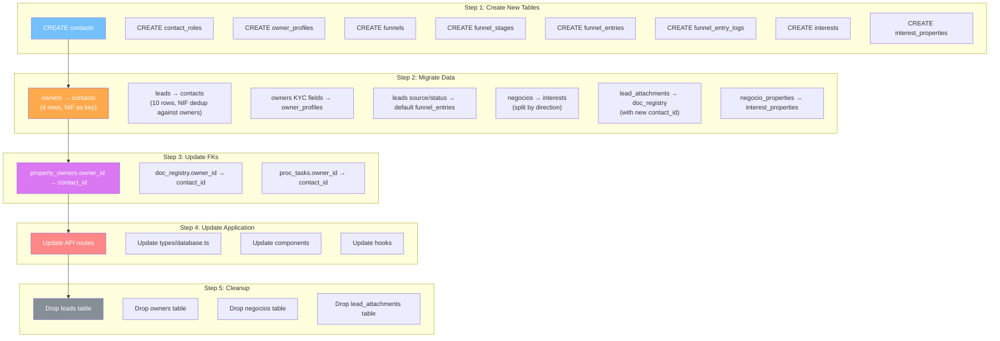
```mermaid
graph TB
    subgraph "Step 1: Create New Tables"
        S1A["CREATE contacts"]
        S1B["CREATE contact_roles"]
        S1C["CREATE owner_profiles"]
        S1D["CREATE funnels"]
        S1E["CREATE funnel_stages"]
        S1F["CREATE funnel_entries"]
        S1G["CREATE funnel_entry_logs"]
        S1H["CREATE interests"]
        S1I["CREATE interest_properties"]
    end

    subgraph "Step 2: Migrate Data"
        S2A["owners → contacts<br/>(4 rows, NIF as key)"]
        S2B["leads → contacts<br/>(10 rows, NIF dedup against owners)"]
        S2C["owners KYC fields → owner_profiles"]
        S2D["leads source/status → default funnel_entries"]
        S2E["negocios → interests<br/>(split by direction)"]
        S2F["lead_attachments → doc_registry<br/>(with new contact_id)"]
        S2G["negocio_properties → interest_properties"]
    end

    subgraph "Step 3: Update FKs"
        S3A["property_owners.owner_id → contact_id"]
        S3B["doc_registry.owner_id → contact_id"]
        S3C["proc_tasks.owner_id → contact_id"]
    end

    subgraph "Step 4: Update Application"
        S4A["Update API routes"]
        S4B["Update types/database.ts"]
        S4C["Update components"]
        S4D["Update hooks"]
    end

    subgraph "Step 5: Cleanup"
        S5A["Drop leads table"]
        S5B["Drop owners table"]
        S5C["Drop negocios table"]
        S5D["Drop lead_attachments table"]
    end

    S1A --> S2A
    S2A --> S3A
    S3A --> S4A
    S4A --> S5A

    style S1A fill:#74c0fc,color:#fff
    style S2A fill:#ffa94d,color:#fff
    style S3A fill:#da77f2,color:#fff
    style S4A fill:#ff8787,color:#fff
    style S5A fill:#868e96,color:#fff
```

### 12.3 Migration SQL (Core Logic)

```sql
-- Step 1: Create contacts from owners (they have richer data)
INSERT INTO contacts (
    id, person_type, name, email, phone, nif,
    id_doc_type, id_doc_number, id_doc_expiry, id_doc_issued_by,
    birth_date, nationality, natural_from,
    address, postal_code, city,
    created_at
)
SELECT
    id,  -- preserve owner UUID as contact UUID
    CASE WHEN person_type = 'singular' THEN 'individual' ELSE 'company' END,
    name, email, phone, nif,
    id_doc_type, id_doc_number, id_doc_expiry, id_doc_issued_by,
    birth_date, nationality, naturality,
    address, postal_code, city,
    created_at
FROM owners;

-- Step 2: Create contacts from leads (dedup by NIF)
INSERT INTO contacts (
    id, person_type, name, email, phone, nif,
    birth_date, nationality, gender,
    address, postal_code, city, district, parish,
    gdpr_consent, marketing_consent,
    created_at
)
SELECT
    l.id,  -- preserve lead UUID
    'individual',
    l.nome, l.email, l.telemovel, l.nif,
    l.data_nascimento, l.nacionalidade, l.genero,
    l.morada, l.codigo_postal, l.localidade, l.distrito, l.freguesia,
    l.consentimento_contacto, l.consentimento_webmarketing,
    l.created_at
FROM leads l
WHERE l.nif IS NULL
   OR l.nif NOT IN (SELECT nif FROM contacts WHERE nif IS NOT NULL);

-- For leads with matching NIF (already in contacts via owners):
-- Create a mapping table for FK updates
CREATE TEMP TABLE lead_contact_map AS
SELECT l.id AS lead_id, c.id AS contact_id
FROM leads l
JOIN contacts c ON c.nif = l.nif
WHERE l.nif IS NOT NULL
UNION ALL
SELECT l.id AS lead_id, l.id AS contact_id
FROM leads l
WHERE l.nif IS NULL
   OR l.nif NOT IN (SELECT nif FROM owners WHERE nif IS NOT NULL);

-- Step 3: Create owner_profiles
INSERT INTO owner_profiles (contact_id, marital_status, profession, ...)
SELECT id, marital_status, profession, ...
FROM owners;

-- Step 4: Create contact_roles
INSERT INTO contact_roles (contact_id, role)
SELECT id, 'owner' FROM owners;

INSERT INTO contact_roles (contact_id, role)
SELECT contact_id, 'lead' FROM lead_contact_map;

-- Step 5: Move lead_attachments to doc_registry
INSERT INTO doc_registry (contact_id, file_url, file_name, status, created_at)
SELECT lcm.contact_id, la.url, la.name, 'active', la.created_at
FROM lead_attachments la
JOIN lead_contact_map lcm ON lcm.lead_id = la.lead_id;
```

---

## 13. Impact Analysis

### 13.1 Files Affected

| Category | Files | Change Type |
|----------|-------|-------------|
| **Types** | `types/database.ts`, `types/lead.ts`, `types/property.ts` | Regenerate + update |
| **Validations** | `lib/validations/lead.ts`, `lib/validations/owner.ts` | Rewrite for contacts |
| **API Routes — Leads** | `app/api/leads/route.ts`, `[id]/route.ts`, `attachments/` | Rewrite → contacts + funnel_entries |
| **API Routes — Owners** | `app/api/owners/route.ts` | Rewrite → contacts + owner_profiles |
| **API Routes — Negocios** | `app/api/negocios/` (8 routes) | Rewrite → interests |
| **API Routes — Processes** | `app/api/processes/` | Update owner_id → contact_id |
| **API Routes — Acquisitions** | `app/api/acquisitions/` | Update to use contacts |
| **Components — Leads** | `components/leads/` (3 components) | Update data shape |
| **Components — Negocios** | `components/negocios/` (5 components) | Rewrite for interests |
| **Components — Owners** | `components/owners/` (2 components) | Update to contacts |
| **Components — Processes** | `components/processes/` | Update owner references |
| **Hooks** | `hooks/use-leads.ts` etc. | Rewrite |
| **Pages** | `app/dashboard/leads/`, `negocios/` | Update |
| **Engine** | `lib/process-engine.ts` | Update owner_id → contact_id |
| **Utils** | `lib/utils/negocio-to-acquisition.ts` | Rewrite |
| **Constants** | `lib/constants.ts` | Add funnel constants |

**Estimated total: ~40 files**

### 13.2 What Does NOT Change

| System | Why |
|--------|-----|
| Authentication (M01) | No connection to leads/owners |
| Properties CRUD (M03) | Only FK rename in property_owners |
| Process Templates (M07) | Template definitions unchanged |
| Document Types (M08) | doc_types table unchanged |
| Media Upload / R2 | Storage logic unchanged |
| Mapbox Integration | Address picker unchanged |
| Notifications | Service unchanged, just different triggers |

### 13.3 Risk Assessment

| Risk | Probability | Impact | Mitigation |
|------|------------|--------|------------|
| Data loss during migration | Low | High | Run migration in transaction, backup first |
| Broken FKs after rename | Medium | High | Test all joins, update all queries |
| Process engine regression | Medium | High | Test autoCompleteTasks with contact_id |
| Missing edge cases in leads dedup | Low | Medium | Manual review of 10 leads before migration |
| UI showing wrong data | Medium | Medium | Test all pages after migration |

---

## 14. Decision Framework

### 14.1 Why This is NOT Over-Engineering

```mermaid
graph LR
    subgraph "What IS over-engineering (current)"
        OE1["negocios: 63 columns<br/>mixing 3 different concepts"]
        OE2["leads + owners:<br/>8 groups of duplicated fields"]
        OE3["lead_attachments:<br/>parallel document system<br/>that connects to nothing"]
        OE4["temperature/status<br/>baked into lead row<br/>forces global state"]
    end

    subgraph "What this proposal does"
        P1["Separates concerns:<br/>identity vs role vs engagement"]
        P2["Single source of truth:<br/>one person = one record"]
        P3["Contextual tracking:<br/>per-campaign, not global"]
        P4["Documents flow naturally:<br/>upload once, use everywhere"]
    end

    OE1 -->|"simplifies to"| P1
    OE2 -->|"eliminates"| P2
    OE4 -->|"replaces with"| P3
    OE3 -->|"replaces with"| P4

    style OE1 fill:#ff8787,color:#fff
    style OE2 fill:#ff8787,color:#fff
    style OE3 fill:#ff8787,color:#fff
    style OE4 fill:#ff8787,color:#fff
    style P1 fill:#51cf66,color:#fff
    style P2 fill:#51cf66,color:#fff
    style P3 fill:#51cf66,color:#fff
    style P4 fill:#51cf66,color:#fff
```

### 14.2 Cost of Waiting

```mermaid
graph LR
    subgraph "Migration cost over time"
        NOW["NOW<br/>10 leads, 4 owners<br/>~200 rows<br/>~40 files<br/>Cost: 1-2 weeks"]
        M6["6 MONTHS<br/>~100 leads, ~20 owners<br/>~2000 rows<br/>~60 files (new features)<br/>Cost: 3-4 weeks"]
        M12["12 MONTHS<br/>~500 leads, ~80 owners<br/>~10000 rows<br/>~100 files<br/>Cost: 6-8 weeks"]
        M24["24 MONTHS<br/>~2000 leads, ~200 owners<br/>~50000 rows<br/>automations built on old schema<br/>Cost: probably never"]
    end

    NOW -->|"grows"| M6
    M6 -->|"grows"| M12
    M12 -->|"grows"| M24

    style NOW fill:#51cf66,color:#fff
    style M6 fill:#ffa94d,color:#fff
    style M12 fill:#ff8787,color:#fff
    style M24 fill:#868e96,color:#fff
```

### 14.3 Summary

| Question | Answer |
|----------|--------|
| Does the current structure work? | Yes, with gaps |
| Are the gaps causing real problems? | Yes — document re-uploads, lost history, no per-campaign tracking |
| Is the proposed structure standard? | Yes — Party Model, used by Salesforce, HubSpot, SAP |
| Is it the right time? | Yes — smallest possible data volume, lowest possible cost |
| What happens if we wait? | Migration cost increases linearly with data and features |
| Is this over-engineering? | No — the current 63-column negocios table with duplicated fields IS the over-engineering |

---

## Appendix A: Complete Schema Diagram

```mermaid
erDiagram
    contacts {
        uuid id PK
        text person_type
        text name
        text email
        text phone
        text nif UK
        text address
        text city
        date birth_date
        text nationality
    }

    contact_roles {
        uuid id PK
        uuid contact_id FK
        text role
        boolean is_active
    }

    owner_profiles {
        uuid contact_id PK
        text marital_status
        text profession
        boolean is_pep
        text legal_rep_name
        jsonb beneficiaries
    }

    funnels {
        uuid id PK
        text name
        text type
        uuid property_id FK
        boolean is_active
    }

    funnel_stages {
        uuid id PK
        uuid funnel_id FK
        text name
        int order_index
        boolean is_terminal
        text terminal_type
    }

    funnel_entries {
        uuid id PK
        uuid contact_id FK
        uuid funnel_id FK
        uuid current_stage_id FK
        text temperature
        text source
        text source_detail
        uuid assigned_to FK
    }

    funnel_entry_logs {
        uuid id PK
        uuid entry_id FK
        uuid from_stage_id FK
        uuid to_stage_id FK
        text notes
    }

    interests {
        uuid id PK
        uuid contact_id FK
        text direction
        text status
        uuid property_id FK
        jsonb search_criteria
        numeric budget_min
        numeric budget_max
    }

    interest_properties {
        uuid id PK
        uuid interest_id FK
        uuid property_id FK
        text status
        text external_url
    }

    dev_properties {
        uuid id PK
        text title
        text status
        numeric listing_price
        text property_type
        text city
    }

    property_owners {
        uuid property_id FK
        uuid contact_id FK
        numeric ownership_pct
        boolean is_main_contact
    }

    doc_registry {
        uuid id PK
        uuid contact_id FK
        uuid property_id FK
        uuid doc_type_id FK
        text file_url
        text status
    }

    proc_instances {
        uuid id PK
        uuid property_id FK
        text current_status
        int percent_complete
    }

    proc_tasks {
        uuid id PK
        uuid proc_instance_id FK
        uuid contact_id FK
        text title
        text status
    }

    contacts ||--o{ contact_roles : "has"
    contacts ||--o| owner_profiles : "extends"
    contacts ||--o{ funnel_entries : "participates"
    contacts ||--o{ interests : "wants"
    contacts ||--o{ doc_registry : "owns docs"
    contacts ||--o{ property_owners : "owns"
    contacts ||--o{ proc_tasks : "assigned"

    funnels ||--o{ funnel_stages : "defines"
    funnels ||--o{ funnel_entries : "contains"
    funnel_stages ||--o{ funnel_entries : "current"
    funnel_entries ||--o{ funnel_entry_logs : "history"

    interests ||--o{ interest_properties : "matches"
    interests }o--o| dev_properties : "selling"
    interest_properties }o--|| dev_properties : "matched"

    property_owners }o--|| dev_properties : "ownership"
    dev_properties ||--o{ proc_instances : "processes"
    proc_instances ||--o{ proc_tasks : "tasks"
    doc_registry }o--o| dev_properties : "property docs"
```

---

## Appendix B: Glossary

| Current Term (PT/mixed) | New Term (EN) | Purpose |
|--------------------------|---------------|---------|
| `leads` | `contacts` + `contact_roles` | Person identity + role |
| `owners` | `contacts` + `owner_profiles` | Person identity + KYC |
| `negocios` | `interests` | Buy/sell/rent intentions |
| `negocio_properties` | `interest_properties` | Matched properties for buyers |
| `lead_attachments` | `doc_registry` | Unified document storage |
| `estado` (lead) | `funnel_entries.current_stage_id` | Per-campaign stage |
| `temperatura` (lead) | `funnel_entries.temperature` | Per-campaign engagement |
| `origem` (lead) | `funnel_entries.source` | Per-campaign attribution |
| `owner_id` (everywhere) | `contact_id` | Unified person reference |
